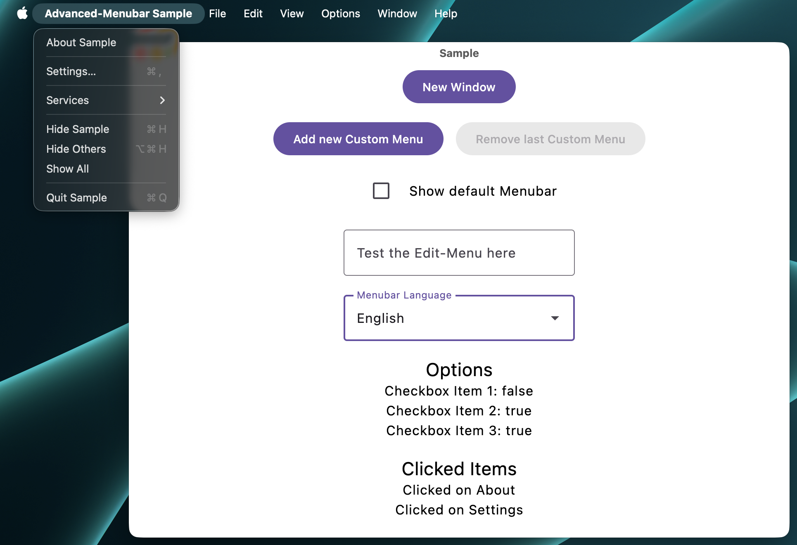

# Advanced Menubar for Compose Desktop



Advanced-Menubar is a Compose Desktop (JVM) library that replaces the default macOS menu bar integration with a declarative DSL. It provides native macOS menus, shortcut handling and fallbacks for Windows and Linux so your desktop apps can ship with a consistent menu experience.

## Features

- **Native macOS menu bar:** Build full Cocoa menus with `AdvancedMacMenu`, including application, file, edit, format, view, window, help, and custom menus driven by Compose state.
- **Cross-platform fallback:** Use `CompatibilityMenu` to render the same menu DSL through Compose `MenuBar` widgets on non-macOS hosts while still delegating to Cocoa on macOS.
- **Out-of-the-box defaults:** Attach a default macOS menu setup with one call to `DefaultMacMenu`, which also brings you the options to set callback of About, Settings and Help.
- **Per-platform visibility controls:** Mark items as macOS-only or Windows/Linux-only with `MenuVisibility` flags so your menus adapt automatically.
- **Shortcut & icon helpers:** Convert Compose icons to template PNGs for the menu bar with `rememberMenuIconFrom` or define `MenuShortcut` values for keyboard access.
- **Localized strings:** [Bundled menu translations](#localized-strings) keep stock menu labels familiar to users.

## Getting started

Compose Advanced-Menubar is published to Maven Central:

```kotlin
repositories {
    mavenCentral()
}

dependencies {
    implementation("dev.hansholz:advanced-menubar:<version>")
}
```

## Usage

### 1. Build a native macOS menu bar

```kotlin
@Composable
fun MacMenu(appName: String) {
    AdvancedMacMenu(appName) {
        MacApplicationMenu {
            About { /* show about dialog */ }
            Separator()
            Settings { /* open settings */ }
            Quit { /* optional custom quit */ }
        }

        MacFileMenu {
            FileNew { createNewDocument() }
            FileOpen { openExisting() }
            Separator()
            FileSave(enabled = fileChanged) { save() }
        }

        MacViewMenu {
            ToggleFullScreen()
        }

        MacCustomMenu("Tools") {
            Item("Reload Data", shortcut = MenuShortcut(Key.R, meta = true)) { reload() }
        }
    }
}
```

`AdvancedMacMenu` rebuilds the Cocoa menu whenever Compose state changes, so enabling/disabling items and checkboxes is seamless.

### 2. Share menus across macOS, Windows, and Linux

```kotlin
@Composable
fun FrameWindowScope.CrossPlatformMenu(appName: String) {
    CompatibilityMenu(appName) {
        MacApplicationMenu {
            About { /* ... */ }
            Quit()
        }
        FileMenu {
            FileOpen { /* ... */ }
            FileSave { /* ... */ }
        }
        HelpMenu {
            AppHelp { openHelpCenter() }
        }
    }
}
```

On macOS this delegates to Cocoa; elsewhere the same DSL is rendered through Compose `MenuBar`.

### 3. Drop in macOS defaults

```kotlin
DefaultMacMenu(
    onAboutClick = { showAboutDialog() },
    onSettingsClick = { openPreferences() },
    onHelpClick = { openDocs() }
)
```

`DefaultMacMenu` only runs on macOS and adds the most common menu entries (Application, View, Window, Help).

### 4. Control visibility per platform

Use the optional `visibility` parameter in items from `CompatibilityMenu` to hide or show items depending on the host OS:

```kotlin
FileMenu {
    FilePageSetup(visibility = MenuVisibility.MACOS_ONLY)
    FilePrint { /* ... */ }
}
```

### 5. Provide menu icons (currently macOS only) and shortcuts

```kotlin
val infoIcon = rememberMenuIconFrom(Icons.Rounded.Info)
CustomMenu("Help") {
    Item("Documentation", macIcon = infoIcon) { openDocs() }
    Item("Reload", shortcut = MenuShortcut(Key.R, meta = true)) { reload() }
}
```

`rememberMenuIconFrom` rasterizes Compose vectors into template PNG bytes ready for the menu bar on macOS, while `MenuShortcut` converts to native key equivalents.

For the `MenuIcon`s on MacOS can also `SFSymbol`s, `Png`s and `File`s be used.

## Localized strings
The strings for the menu bars are localized using Compose Resources and the default language can be changed with `Locale.setDefault(...)`.

Currently, the following languages are supported:
- English
- German

## Sample project

You can find a sample project in the sample directory. Run the following command to test it:

```bash
./gradlew :sample:runDistributable
```

## License

Advanced-Menubar is distributed under the Apache 2.0 license. See [LICENSE.txt](LICENSE.txt).